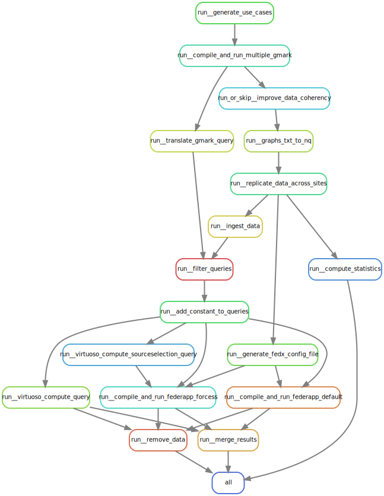

= SPARQL Federated Benchmark
GICQUEL Mathieu; LE CROM Yotlan
:toc:

== Meaning

This benchmark create automatcly **RDF data** and **SPARQL queries** based on link:https://github.com/gbagan/gmark[gMark]. Indeed, you need to set whatever you want in the setting file `lib/gmark/use-cases/shop.xml`. Moreover, you can set additionnal setting in the setting file `configuration.yaml`. To conclude on setting, you can set the number of site in the file `multiple-run.sh`.

== How to use SPARQL Federated Benchmark ?

At first, you need to create `configuration.yaml` at the root of this repository. 
See `configuration.example.yaml` for an example of valid configuration file.

.To execute the whole project, you can execute on of these command :
- `snakemake -c1 -p` to execute just one time with one setting number of site
- `./multiple-run.sh` to execute multiple time with multiple setting number of site

=== How it works ?

The workflow defined in Snakemake correspond to the following rule graph :

// generate with :
//      snakemake --forceall --rulegraph | dot -Tsvg > ./docs/snakemake_dag.svg

.When you execute the whole project, the execution follows theses steps :
* Rule `run__generate_use_cases`: 
This rule is in charge of generating the gmark configuration files

** `"python3 ./scripts/generate_use_cases.py " + USE_CASE_INPUT_FILE + " " + os.path.dirname(SHOP_XML)` where USE_CASE_INPUT_FILE is the shop.xml file from gMark's use cases and SHOP_XML is the shop.xml file for each site

* Rule `run__compile_and_run_multiple_gmark`:
This rule is in charge of the compilation and execution of gmark over all gmark configuration files

** `"./scripts/compile_and_run_multiple_gmark.sh " + str(SITE) + " " + str(use_watdiv)` where SITE is the number of SITE and use_watdiv is a boolean to specify if we want to use WatDiv queries or not. Moreover, compile_and_run_multiple_gmark work like gMark, but we generate 1 gMark for each site. To conclude, after we generate all shop-workload.xml file into 1 shop-workload.xml file to generate all the queries for all site

* Rule `run_or_skip__improve_data_coherency`:
This rule is in charge of improving the coherency over all generated graphs if `improve_data_coherency` is enabled, else, leave as it is

** `"if "+ str(improve_data_coherency) +" ; then python3 scripts/improve_data_coherency.py {input.graph} {output.graph} ; else cat {input.graph} >> {output.graph} ; fi"` where improve_data_coherency is a boolean to specify to use improve_data_coherency script or not. Moreover, input.graph is the file without fixed data, and output.graph is the file with fixed data

* Rule `run__graphs_txt_to_nq`:
This rule is in charge of translating all the graphs txt into one nq file.

** `"python3 scripts/graphs_txt_to_nq.py "+ os.path.dirname(MULTI_GMARK_GRAPH) +" {output}"` where  MULTI_GMARK_GRAPH is the folder where all the txt data are and output is the nq data file (One file for all txt data file)

* Rule `run__replicate_data_across_sites`:
This rule is in charge of replicating chunks of data across sites.

** `"python3 scripts/replicate_data_across_sites.py {input} {output}"` work like improve_data_coherency, but with nq file. Moreover, replicate_data_across_sites.py scripts add sameAs predicate between Product from same Retailer but on different site (he duplicate Retailer)

* Rule `run__generate_fedx_config_file`:
This rule is in charge of generating the configuration file for RDF4J - FedX, used in Federapp application.

** `"python3 scripts/generate_fedx_config_file.py {input} {output} " + ENDPOINT` where input.data is our fixed and distributed data, output.config is the config file we generate to use it in RDF4J - FedX (one named graph = one endpoint) and ENDPOINT is our virtuoso endpoint

* Rule `run__translate_gmark_query`:
This rule is in charge of translating gmark raw queries into correct queries. As instance, this step correct URIs, and convert ASK queries to SELECT * ... LIMIT 1 queries.

** `"python3 scripts/translate_gmark_query.py {params.query} {output.output_query}"` is crucial too because we fixe original query to work with our fixed and distributed data. Moreover, output.queries is translated queries and output.queries_ss is special queries to get optimal source selection for each triples in corresponding query

* Rule `run_ingest_data`:
This rule is in charge of loading data into virtuoso.
** `"./scripts/ingest_data.sh '" + ISQL + "' " + os.path.dirname(os.path.abspath(DATA_NQ)) + " > {output}"` where ISQL is the place of the virtuoso's isql terminal and DATA_NQ is the convert data from the last steps

* Rule `run__filter_queries`:
This rule is in charge of removing the queries that has no result. Indeed, these queries are not useful when studying the source selection.
** `"python3 ./scripts/filter_queries.py " 
            + os.path.dirname(QUERY_TRANSLATED) + " " 
            + "--output " + os.path.dirname(FILTERED_QUERY) + " "
            + "--entrypoint " + ENDPOINT + " "
            + str(KEEP_QUERIES) + " "` where QUERIES_PREPA is the folder where our fixed and distributed queries are, FILTERED_QUERY  is the folder where queries who return result are, ENDPOINT is virtuoso endpoint and KEEP_QUERIES is the number of queries who return result we want to keep.

* Rule `run__add_constant_to_queries`:
This rule is in charge of adding a constant into queries in order to reduce their selectivity.

** `"python3 ./scripts/add_constant_to_queries.py "
            + os.path.dirname(FILTERED_QUERY)
            + " --output " + os.path.dirname(QUERY_WCST) + ""` where FILTERED_QUERY are our queries we keep from the previous step and QUERY_WCST is our keeping queries with some constant inside

* Rule `run__virtuoso_compute_sourceselection_query`:
This rule is in charge of computing the optimal source selection of queries.
** `"python3 ./scripts/run_query_on_virtuoso.py {input.query} \
            --entrypoint {params.endpoint} \
            --output {output.result}"` where input.query is our source selection query, to get optimal source selection to precize for each triples for corresponding query in RDF4J - FedX, params.endpoint is our virtuoso endpoint and output.result is result for each query

* Rule `run__virtuoso_compute_query`:
This rule is in charge of computing queries and measuring different metrics.
** `"python3 ./scripts/run_query_on_virtuoso.py {input.query} \
            --entrypoint {params.endpoint} \
            --output {output.result}"` where is the same steps as the previous step, but with the query with some constant inside

* Rule `run__compile_and_run_federapp_forces`:
This rule is in charge of computing queries using RDF4J - FedX, knowing the optimal source selection, and measuring different metrics.
** `"./scripts/compile_and_run_federapp.sh "
        + os.getcwd() +"/{input.config} "
        + os.getcwd() +"/{input.query} "
        + os.getcwd() +"/{output.result}  "
        + os.getcwd() +"/{output.stat} "
        + os.getcwd() +"/{output.sourceselection} "
        + os.getcwd() +"/{output.httpreq} "
        + " > " + os.getcwd() +"/{output.log}"` where is the same steps as the previous step, but with RDF4J. Moreover, here we execute query with constant inside and with no forced source selection for triples

* Rule `run__compile_and_run_federapp_default`:
This rule is in charge of computing queries using RDF4J - FedX, without knowing the optimal source selection, and measuring different metrics.
** `"./scripts/compile_and_run_federapp.sh "
        + os.getcwd() +"/{input.config} "
        + os.getcwd() +"/{input.query} "
        + os.getcwd() +"/{output.result}  "
        + os.getcwd() +"/{output.stat} "
        + os.getcwd() +"/{output.sourceselection} "
        + os.getcwd() +"/{output.httpreq} "
         + os.getcwd() +"/{input.ssopt} "
        + " > " + os.getcwd() +"/{output.log}"` where is the same steps as the previous step, but with query with constant and with forced source selection for triples

* Rule `run__remove_data`:
This rule is in charge of dropping the data. 

NOTE: Please note that this step can be disabled in the configuration file.

** `"./scripts/remove_data.sh '" + ISQL + "' > {output.log}"` to delete data from virtuoso

* Rule `run__merge_results`:
This rule is in charge of aggregating the different metrics in a few files.
** `"python3 scripts/merge_results.py 'result/site-" + str(SITE) + "' 'result/'"` where we merge result in 3 files (one for virtuoso, one for RDF4J with default source selection and one for RDF4J with forced source selection)

* Rule `run__compute_statistics`:
This rule is in charge of proving different statistics regarding the data.
** `"python3 ./scripts/compute_statistics.py {input.data} {output}"` where we create a yaml statistic file to get some statistic for number of entity for each Retailer and link between them

NOTE: You can disabled `./scripts/improve_data_coherency.py` by setting in `configuration.yaml` improve_data_coherency to False to decrease execution time, but without this scripts, you may not have a logical data schema !

NOTE: You can decrease number of node to decrease execution time and to have logical data schema !

NOTE: You can use WatDiv queries by setting in `configuration.yaml` use_watdiv to True

== How to understand result and generate some plot on it ?

.To do this is simple, you only need to let `./multiple-run.sh` do it, or if you use the snakemake command, you can execute this command:
- `python3 ./scripts/plot.py`

NOTE: You can choose what plot you want by comment or uncomment some line in `./scripts/plot.py` (see in plot.py commentary to have more information on it)

== Demonstration

.In the `demo` folder, we put all data, queries and plot for this configuration:
- TODO